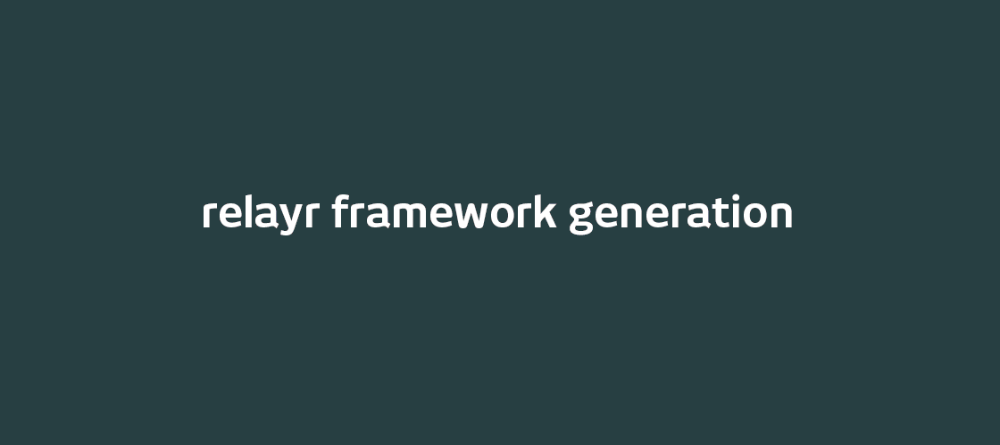
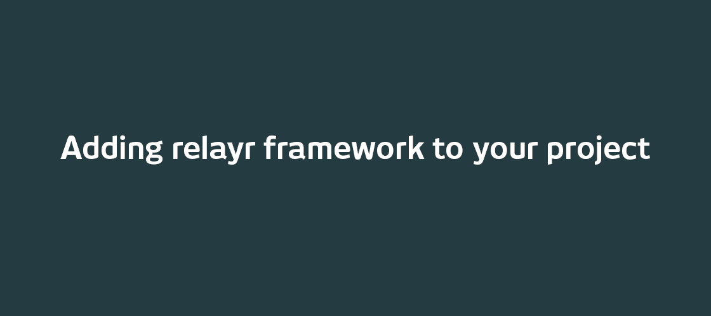
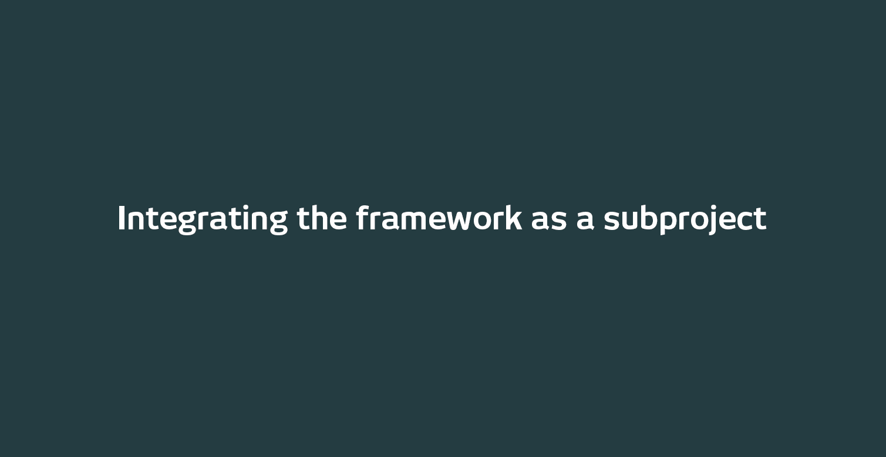

# Introduction
--------------
Welcome to the relayr Apple-SDK repository.
This repository contains the code which allows you to build the relayr Framework for iOS and MAC OS X. The *RelayrSDK* project generates a product called `Relayr.framework`, which, depending on your use purpose, can be run on a mac or on an iOS device.

Currently, the only dependecy of the project is the PUBNUB library. 
If you are interested in building the framework *for iOS devices*, you will require **Xcode 6 and iOS 8**, since embedded frameworks have only been introduced in iOS 8 enable devices. 
For Mac applications, you can use Xcode 5.

## The Build process
--------------
There are currently two options to implement the `Relayr.framework` in your project:

#### Option 1: Getting the *.framework* file and dragging and dropping it into your project.

  * Download or generate the `Relayr.framework` file:
     
     
  
  * Drag and drop the file into your project and make sure that the framework appears both in *Embedded Binaries* and in *Linked Frameworks and Libraries*:
     
     

#### Option 2: Integrating the *RelayrSDK* project as a subproject of your workspace and then dragging and dropping the product into the *Embedded Binaries* tab:

  

## Usage
-----

The `Relayr.framework` has a small subset of useful classes.

### Web features

The Relayr framework can call the Relayr servers for information on apps, users, transmitters, devices, etc. It is worth noticing that all these calls are asynchronous and the answers take an amount of time proportional to the quality of your connection and the size of the response asked for.

* `RelayrCloud.h`. It is used as a static class to check up several status from the Relayr Cloud.

  ```objective-c
  [RelayrCloud isReachable:^(NSError* error, NSNumber* isReachable){
      if (isReachable.boolValue) {
          NSLog(@"The Relayr Cloud is reachable!")
      }
  }];
  ```

* `RelayrApp.h`. It represents a Relayr Application. You can think of it as the representation of your iOS/OSX app in the Relayr Cloud. You create an object with the *appID*, *OAuthClientID*, *OAuthClientSecret*, and *redirectURI* given to you when you create a Relayr Application in [developer.relayr.io](https://developer.relayr.io).

  ```objective-c
  [RelayrApp appWithID:@"..." OAuthClientID:@"..." OAuthClientSecret:@"..." redirectURI:@"..." completion:^(NSError* error, RelayrApp* app){
      if (app) {
          NSLog(@"Application with name: %@ and description: %@" app.name, app.description);
          self.app = app;
      }
  }];
  ```
  
  You can look into the app properties, query the server for information related to the up, or more commonly to sign in and sign out users into your application.
  
  ```objective-c
  [self.app signInUser:^(NSError* error, RelayrUser* user){
      if (user) {
          [self.users addObject user];
      }
  }];
  ```

* `RelayrUser.h` represents a logged in users. Users can access data from devices or sent data to the cloud. They can check for transmitters/devices they own. Bookmark favorite devices or even become publishers. You can have as many logged in users as you want.

  ```objective-c
  RelayrUser* user = ...;
  NSLog(@"User with name: %@ and email: %@", user.name, user.email);
  
  // Lets ask the cloud for all the transmitters/devices own by this specific user.
  [user queryCloudForIoTs:^(NSError* error, NSNumber* isThereChanges){
      if (error) { return; }
      
      for (RelayrTransmitter* tran in user.transmitters)
      {
          NSLog(@"Transmitter's name: %@", tran.name);
      }
      
      for (RelayrDevice* dev in user.devices)
      {
          NSLog(@"Device's name: %@", dev.name);
      }
  }]
  ```

* `RelayrTransmitter.h` instance represents a bridge that connects to sensors (usually BLE) to the Relayr Cloud. For example, the Wunderbar is composed of 7 pieces: 1 Transmitter (Master Module) and 6 BLE sensors. The transmitter takes the data from the 6 sensors and send it over MQTT to the Relayr Cloud. From there, that data is routed to any Relayr App/User interested on it.

* `RelayrDevice.h` represents a sensing device. A single Relayr device can *sense* many values at the same time. Thus, you should always query for the capabilities of the device.
